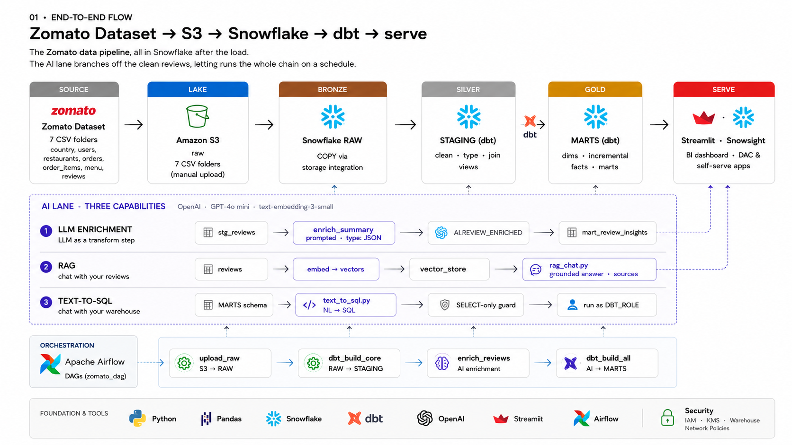
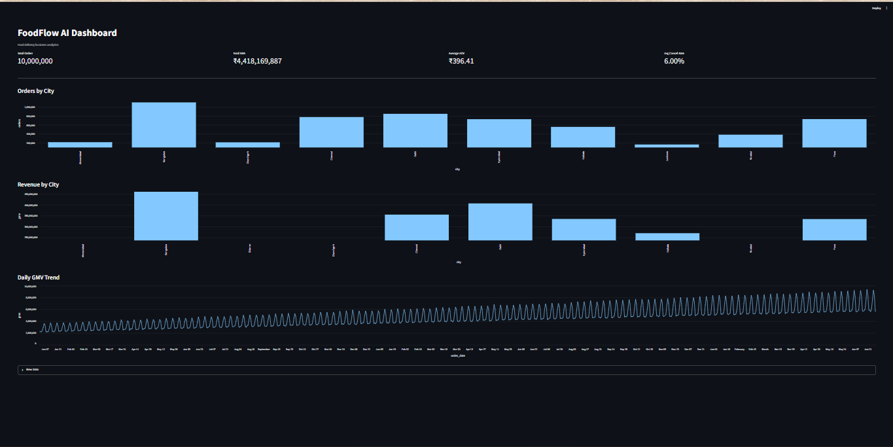
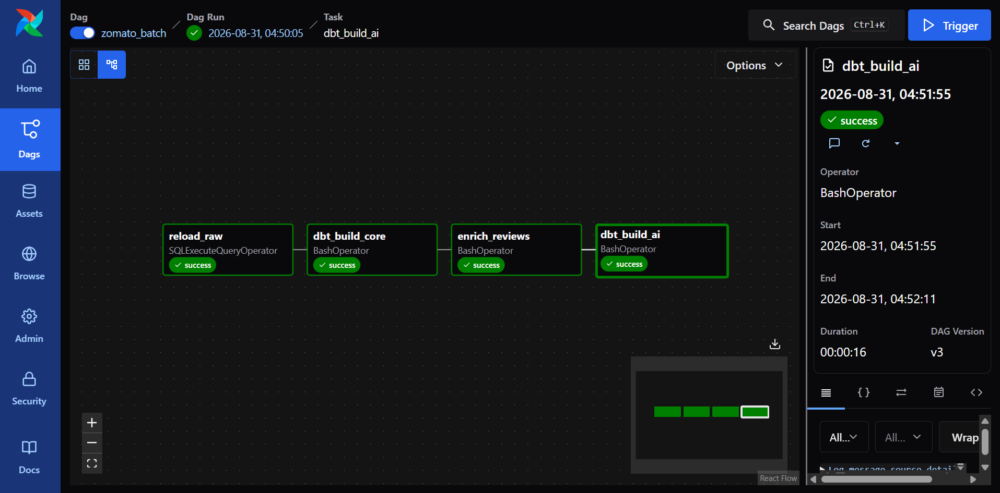
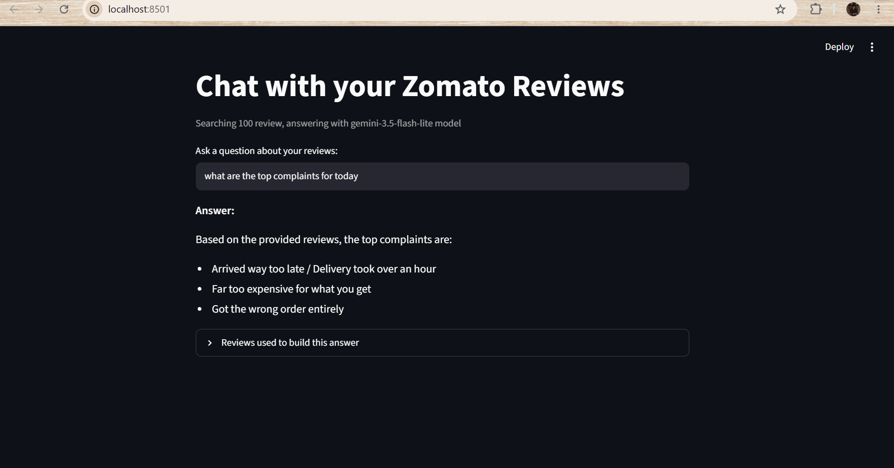
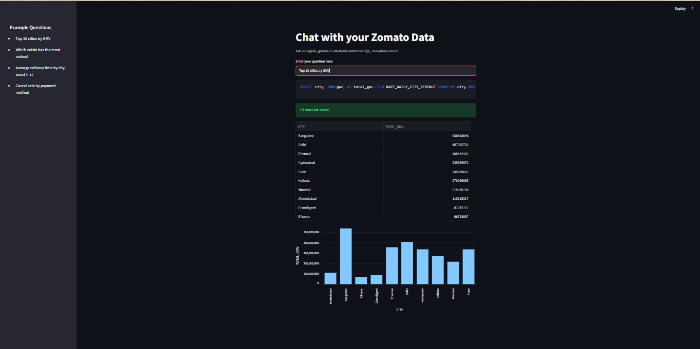

# FoodFlow AI
## 1. Zomato Dataset



An end-to-end **Data Engineering + AI analytics platform** for a Zomato-style food delivery dataset.

The project ingests raw data into Amazon S3, loads it into Snowflake, transforms it through Bronze/RAW → Silver/STAGING → Gold/MARTS using dbt, orchestrates the workflow with Apache Airflow, and adds three AI capabilities with Gemini:

1. **LLM Enrichment** – classifies customer reviews by sentiment, sentiment score, topic, and key issue.
2. **RAG** – lets users ask natural-language questions about customer reviews using embeddings and semantic similarity.
3. **Text-to-SQL** – converts natural-language business questions into safe Snowflake SQL and returns the result.

A Streamlit dashboard provides business-facing KPIs and visualizations on top of the Gold/MART layer.

## Architecture

## 5. Streamlit Dashboard



```text
Zomato Dataset
     ↓
Amazon S3
     ↓
Snowflake RAW / Bronze
     ↓
dbt STAGING / Silver
     ↓
dbt MARTS / Gold
     ↓
Streamlit Dashboard

AI lane:
Snowflake Reviews
     ↓
Gemini Enrichment → ZOMATO.AI.REVIEW_ENRICHED
     ↓
mart_review_insights

Snowflake Reviews
     ↓
Gemini Embeddings → review_embeddings.parquet
     ↓
RAG

Snowflake MARTS
     ↓
Gemini Text-to-SQL
     ↓
Safe SELECT-only SQL
     ↓
Snowflake Result
```

## Data Layers

### Bronze / RAW
Raw files are loaded from S3 into Snowflake RAW tables with minimal transformation.

Examples:
- `ZOMATO.RAW.RESTAURANTS`
- `ZOMATO.RAW.USERS`
- `ZOMATO.RAW.FOOD`
- `ZOMATO.RAW.MENU`
- `ZOMATO.RAW.ORDERS`
- `ZOMATO.RAW.ORDER_ITEMS`
- `ZOMATO.RAW.REVIEWS`

### Silver / STAGING
dbt cleans and standardizes the raw data and creates reusable staging models.

Examples:
- `stg_restaurants`
- `stg_users`
- `stg_food`
- `stg_menu`
- `stg_orders`
- `stg_order_items`
- `stg_reviews`

### Gold / MARTS
dbt creates business-ready models for analytics.

Examples:
- `dim_customer`
- `dim_date`
- `dim_food`
- `dim_restaurants`
- `fct_orders`
- `fct_order_items`
- `mart_daily_city_revenue`
- `mart_restaurant_performance`
- `mart_delivery_sla`
- `mart_review_insights`

## Orchestration with Apache Airflow
## 2. Airflow Orchestration



The Airflow DAG is:

```text
reload_raw
    ↓
dbt_build_core
    ↓
enrich_reviews
    ↓
dbt_build_ai
```

The DAG uses a daily schedule:

```python
schedule="@daily"
catchup=False
```

### Task responsibilities

**`reload_raw`**  
Runs Snowflake `COPY INTO` statements to load data from the S3 stage into RAW tables.

**`dbt_build_core`**  
Builds the core dbt models while excluding models tagged `ai`.

**`enrich_reviews`**  
Runs the Python review enrichment script using Gemini.

**`dbt_build_ai`**  
Builds dbt models tagged `ai`.

This orchestration removes the need to manually execute each pipeline step in sequence once Airflow is running and the DAG is enabled.

## AI Capability 1 — LLM Review Enrichment

## 3. RAG — Chat with Zomato Reviews



`ai/enrich_reviews.py` reads customer reviews from Snowflake and sends them to Gemini.

For each review it produces:
- `sentiment_label`
- `sentiment_score`
- `topic`
- `key_issue`

Results are stored in:

```text
ZOMATO.AI.REVIEW_ENRICHED
```

Flow:

```text
Customer Review
      ↓
Gemini
      ↓
Sentiment / Topic / Key Issue
      ↓
Snowflake AI table
```

The dbt model `mart_review_insights.sql` combines the enriched review information with staging review data and produces aggregated review insights.

## AI Capability 2 — RAG

## 4. Text-to-SQL



The RAG application is implemented in:

```text
ai/rag.py
```

Flow:

```text
Snowflake Reviews
      ↓
Gemini Embeddings
      ↓
Cosine Similarity
      ↓
Top-K Relevant Reviews
      ↓
Gemini
      ↓
Answer
```

Current models:

```text
Embedding: gemini-embedding-001
Chat: gemini-3.5-flash-lite
```

Embeddings are cached locally in:

```text
review_embeddings.parquet
```

The cache is excluded from Git.

## AI Capability 3 — Text-to-SQL

The Text-to-SQL application is implemented in:

```text
ai/text_to_sql.py
```

Flow:

```text
Natural-language question
          ↓
Gemini
          ↓
SQL generation
          ↓
SELECT / CTE safety check
          ↓
Snowflake
          ↓
Table / Chart
```

The prompt provides Gemini with the available Snowflake MARTS schema.

The application restricts execution to read-only SQL and blocks data-changing keywords. Queries run using the `DBT_ROLE`.

Example:

```text
Top 10 cities by GMV
```

## Streamlit Dashboard

The dashboard is implemented in:

```text
ai/dashboard.py
```

It reads business-ready data from the Snowflake Gold/MART layer.

Current dashboard views include:
- Total Orders
- Total GMV
- Average AOV
- Average Cancel Rate
- Orders by City
- Revenue by City
- Daily GMV Trend
- Underlying data table

This creates the analytics serving layer:

```text
Snowflake MARTS → Streamlit Dashboard
```


## Technology Stack

| Area | Technology |
|---|---|
| Source | Zomato dataset / CSV |
| Data Lake | Amazon S3 |
| Data Warehouse | Snowflake |
| Transformation | dbt |
| Orchestration | Apache Airflow |
| Containers | Docker / Docker Compose |
| AI / LLM | Google Gemini API |
| Embeddings | Gemini Embeddings |
| Application | Streamlit |
| Programming | Python |
| Data Processing | Pandas / NumPy |

## Project Structure

```text
FoodFlow-Ai/
│
├── ai/
│   ├── dashboard.py
│   ├── enrich_reviews.py
│   ├── rag.py
│   └── text_to_sql.py
│
├── airflow/
│   ├── dags/
│   │   └── zomato_batch.py
│   ├── dbt_profiles/
│   │   └── profiles.yml
│   ├── Dockerfile
│   ├── docker-compose.yaml
│   └── .env                 # local only
│
├── zomato/
│   ├── models/
│   ├── macros/
│   ├── tests/
│   ├── seeds/
│   ├── snapshots/
│   └── dbt_project.yml
│
├── .gitignore
└── README.md
```

## Environment Variables

Create local `.env` files with your own credentials.

Example:

```env
SNOWFLAKE_ACCOUNT=
SNOWFLAKE_USER=
SNOWFLAKE_PASSWORD=
SNOWFLAKE_WAREHOUSE=ZOMATO_WH
SNOWFLAKE_DATABASE=ZOMATO
SNOWFLAKE_SCHEMA=AI
GEMINI_API_KEY=
```

**Never commit real credentials to GitHub.**

Use an `.env.example` with empty values for public repositories.

## Running Locally

### Start Airflow

From the `airflow` directory:

```powershell
docker compose up -d
```

Airflow UI:

```text
http://localhost:8080
```

The DAG is:

```text
zomato_batch
```

### Run RAG

From the `ai` directory:

```powershell
python -m streamlit run rag.py
```

### Run Text-to-SQL

```powershell
python -m streamlit run text_to_sql.py
```

### Run Dashboard

```powershell
python -m streamlit run dashboard.py
```

If port `8501` is already in use, Streamlit will select another available port.

## Operational Flow

```text
New data available in S3
        ↓
Airflow scheduled DAG
        ↓
COPY INTO Snowflake RAW
        ↓
dbt core transformations
        ↓
Gemini review enrichment
        ↓
dbt AI models
        ↓
Updated Snowflake analytics layer
        ↓
Streamlit / Text-to-SQL / RAG
```

Because Airflow is running locally in Docker for this development setup, the computer and Docker engine must be running for scheduled local execution.

## Security

The repository excludes:

```text
.env
*.env
*.parquet
logs/
target/
__pycache__/
*.pyc
```

This prevents credentials, local caches, runtime logs, and generated artifacts from being committed.

## Key Engineering Concepts Demonstrated

- S3 → Snowflake ingestion
- Snowflake external stages and `COPY INTO`
- Bronze / Silver / Gold architecture
- dbt modular transformations
- Fact and dimension modeling
- Airflow DAG orchestration and scheduling
- Python-based AI enrichment
- LLM structured output
- Embeddings and cosine similarity
- Retrieval-Augmented Generation (RAG)
- Natural-language-to-SQL
- SQL safety controls
- Streamlit analytics
- Dockerized local development

## Interview Summary

> FoodFlow AI is an end-to-end data engineering and AI analytics platform. I ingest raw food-delivery data through S3 into Snowflake, use dbt to build staging and business-ready mart layers, and use Airflow to orchestrate ingestion, transformations, and AI enrichment. I added Gemini-powered review enrichment, a RAG application for semantic review analysis, and a Text-to-SQL interface for natural-language warehouse queries. Finally, I built a Streamlit dashboard on top of the Gold/MART layer for business analytics.

## Future Improvements

- Move RAG embeddings from the local Parquet cache to a production vector store or Snowflake vector capability.
- Add incremental ingestion so only newly arrived records are processed.
- Strengthen SQL validation beyond keyword checks.
- Add automated data-quality tests and alerting in Airflow.
- Deploy Airflow and Streamlit to cloud infrastructure for always-on operation.
- Add CI/CD for dbt and application code.
